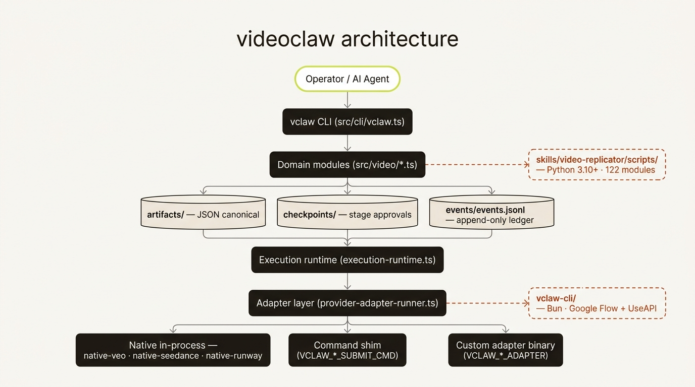
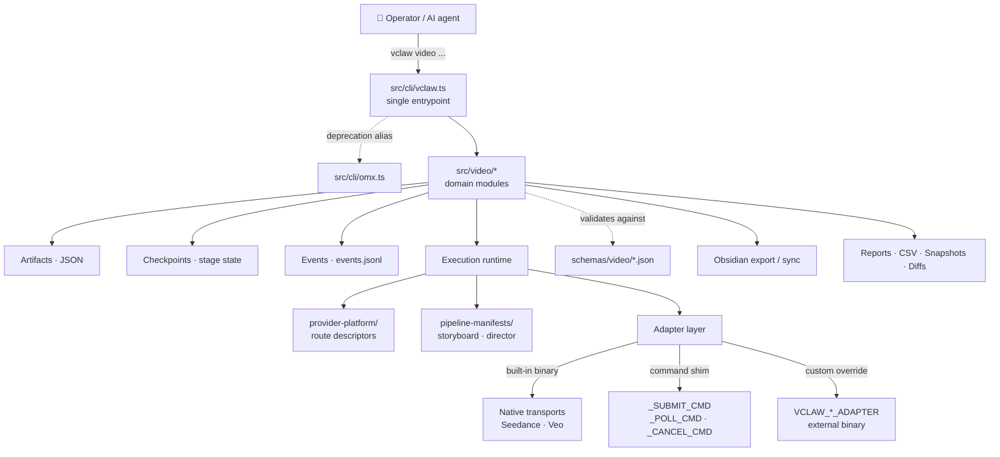
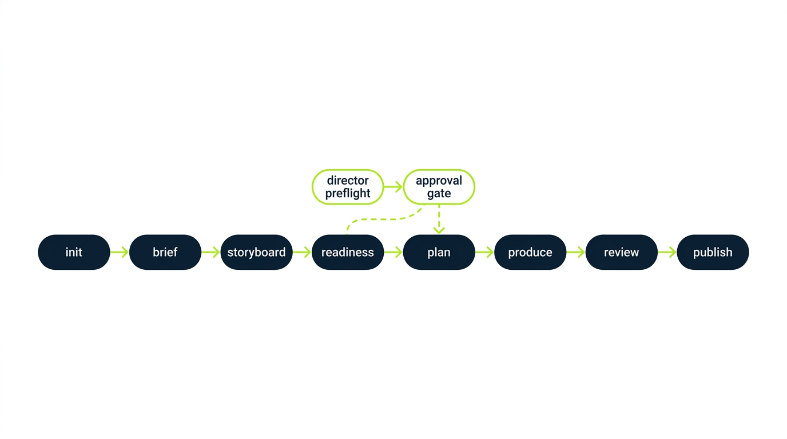
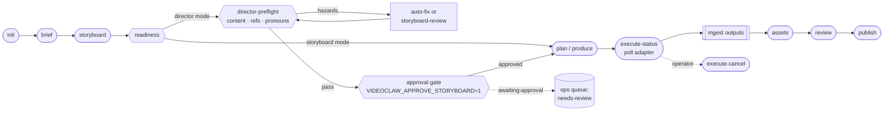
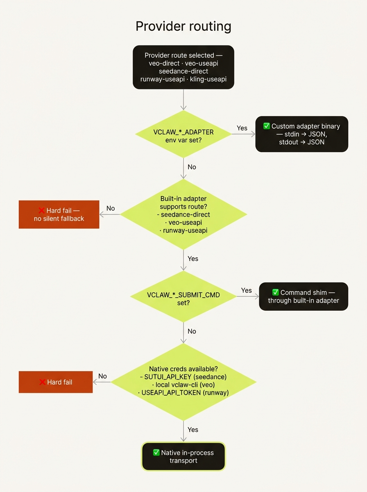
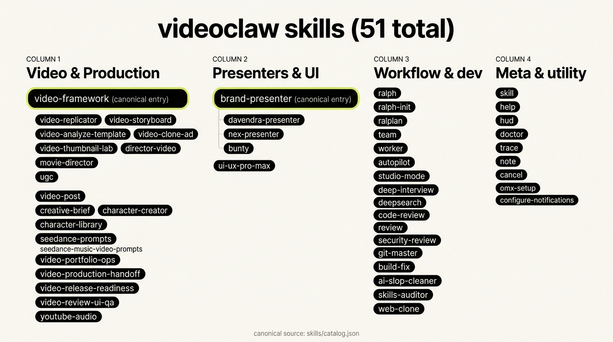
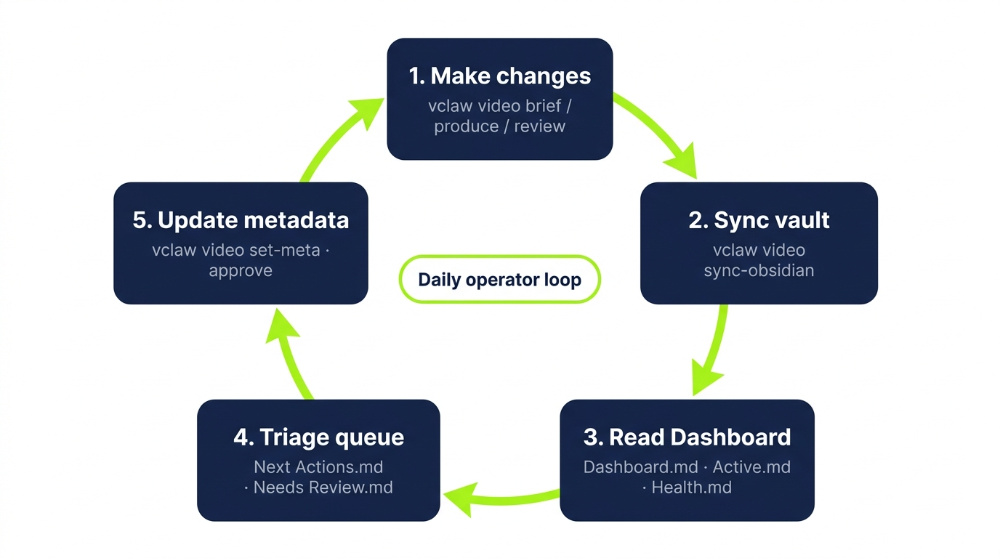

<div align="center">


# videoclaw

**Multi-provider AI video CLI with explicit stage artifacts, approval gates, and a browser-based Review UI.**

A TypeScript/Node 20 CLI that turns an intent string into a reviewed,
provider-executed, portfolio-tracked video project — with an explicit,
machine-readable artifact at every stage. Supports Veo (Google Flow direct
+ UseAPI including Omni Flash), Seedance, and Runway out of the box;
Kling adapter scaffolded.

[](https://github.com/davendra/videoclaw-v2/actions/workflows/ci.yml)
[](./package.json)
[](./tsconfig.json)
[](./docs/MASTER_PLAN_ALIGNMENT.md)
[](./LICENSE)

[30-second quickstart](#-30-second-quickstart) · [Production workflow](#-production-workflow) · [For AI agents](#-for-ai-agents) · [Architecture](#-architecture) · [Skills](#-skills-catalog) · [Docs map](#-documentation-map)

</div>

---

## 💡 Why this exists

`videoclaw-v2` (npm: `videoclaw`) is the **merged successor** of two predecessor codebases:

- the older `videoclaw` package (v0.11.x), which had an orchestration layer (ralph / ralplan / team / MCP servers) on top of a video pipeline
- the clean-room `vclaw-video-core` rebuild, which kept only the video pipeline with strict on-disk artifacts and approval gates

v2 takes `vclaw-video-core` as the foundation, **drops the orchestration layer** (Claude Code, Codex, and the OMC plugin now cover those workflows natively), and **ports forward selected pieces from the original `videoclaw`**: the `vclaw-cli` Bun package (formerly `veo-cli`) for Google Labs Flow + UseAPI, the Runway transport, a curated Python pipeline, and the Google Flow v1 + Omni Flash backend additions.

- 🎥 **Video-first command surface** — one `vclaw video ...` namespace that mirrors the actual production flow.
- 📄 **Explicit stage artifacts** — every stage writes a JSON artifact you can diff, validate, and replay.
- 🚫 **No silent fallback** — provider routes fail hard instead of pretending a different route worked.
- 🖥️ **Browser-based Review UI** — `vclaw video review-ui` boots an HTTP server with a single-page storyboard review station.
- 🤖 **Agent-ready by design** — machine-readable output, strong docs, and a skills catalog that agents can orient against.

See [`MERGE_PLAN.md`](./MERGE_PLAN.md) for the full merge rationale and per-phase commits, and [`docs/ARCHITECTURE.md`](./docs/ARCHITECTURE.md) for the layer map.

---

## 🤖 For AI agents

> **You are landing in a TypeScript/Node 20 CLI repo.** If you do nothing else, read these in order:
>
> 1. **[`CLAUDE.md`](./CLAUDE.md)** — non-obvious conventions, single-test command, review-state invariant, agent-first orientation.
> 2. **[`AGENTS.md`](./AGENTS.md)** — autonomy directive, coding style, commit/PR format, security expectations.
> 3. **[`docs/ARCHITECTURE.md`](./docs/ARCHITECTURE.md)** — layer map and the canonical project flow.
> 4. **[`skills/catalog.json`](./skills/catalog.json)** — machine-readable skill surface (don't scrape markdown).
> 5. **[`docs/MASTER_PLAN_ALIGNMENT.md`](./docs/MASTER_PLAN_ALIGNMENT.md)** — what ships today + honest remaining gaps.
>
> **Canonical entry skills** — start broad, specialize later: `video-framework` · `brand-presenter`
> **Contracts** — `schemas/video/*.json` is the source of truth for artifact shapes.
> **Tests** — `src/tests/*.test.ts` run via `node --test dist/tests/*.test.js`.
>
> **Don't:** edit `dist/` · drop `.js` extensions from relative imports (NodeNext ESM requires them) ·
> add silent fallback across materially different provider routes · commit `.omx/` / `.vclaw/` / secrets.

### Agent integration

videoclaw is built as a target for agent hosts, not as an orchestrator.

- **One-call discovery:** `vclaw schema --json` returns the full command contract.
- **MCP server:** `vclaw mcp serve` exposes read-only state queries to MCP-aware hosts.
- **Sample skills:** see `mcp/skills-pack/` for Claude Code skill templates.

See [`docs/AGENT_INTEGRATION_RESEARCH.md`](docs/AGENT_INTEGRATION_RESEARCH.md) for the design rationale.

---

## 🚀 30-second quickstart

These commands are for a source checkout. Installed package users can replace
`node dist/cli/vclaw.js` with `vclaw` after installing the CLI.

```bash
npm install                                   # Node 20+
npm run build                                 # tsc + chmod the CLI bins
npm test                                      # full suite via node:test
node dist/cli/vclaw.js video providers        # environment + route readiness
```

One full lifecycle against a throwaway project:

```bash
node dist/cli/vclaw.js video init demo
node dist/cli/vclaw.js video brief    --project demo --title "Demo" --intent "A 15s product tease"
node dist/cli/vclaw.js video storyboard --project demo --scene "open on product" --scene "close on logo"
node dist/cli/vclaw.js video plan     --project demo
node dist/cli/vclaw.js video produce  --project demo --dry-run
node dist/cli/vclaw.js video status   --project demo
```

Prefer the packaged pre-flight:

```bash
npm run check:release-readiness-lite          # build + tests + smokes + isolated image-storyboard E2E + guardrails
```

---

## 🎬 Production Workflow

Most users should enter through one of three paths:

1. **Make a campaign video** — `create` the director project, open `review-ui`,
   lock real storyboard stills, attach artifact-backed 4K stills, then publish
   only after the saved review report has `verdict: "pass"` and
   `metrics.publishReady: true`.
2. **Review and fix a project** — use `status`, `next-actions`,
   `doctor-project`, and `review-ui` to find the single safest next step.
3. **Manage a portfolio** — use `metrics`, `report`, `export-csv`, and
   `sync-obsidian` to see blocked, stale, review-needed, and publish-ready work.

The advanced command surface stays available, but production trust comes from
one invariant: a handoff is ready only when `review-report.json` has
`verdict: "pass"` and `metrics.publishReady: true`.
The simple `video review --verdict pass` command intentionally writes that
approval for already-reviewed projects; for director storyboard-image handoffs,
use `review-ui` or `review-autopilot` so `publishReady` is derived from locked
scene candidates, artifact-backed 4K stills, and final assembly approvals.

Full operator guide: [`docs/PRODUCTION_WORKFLOW.md`](./docs/PRODUCTION_WORKFLOW.md).
Handoff checklist: [`docs/OPERATOR_HANDOFF.md`](./docs/OPERATOR_HANDOFF.md).

---

## 🏗️ Architecture

<p align="center"></p>

<details>
<summary>Show diagram source (Mermaid)</summary>



</details>

- **CLI layer** — argparse + dispatch only; no business logic.
- **Domain layer** (`src/video/*`) — small, single-purpose modules. Each file owns one concept (artifacts, checkpoints, readiness, execution-plan, execution-runtime, doctor, metrics, next-actions, project-index, obsidian-export, etc.).
- **Provider platform** — route descriptors for `veo-direct`, `veo-useapi`, `seedance-direct`, `seedance-useapi`, `runway-useapi`, `kling-useapi`.
- **Adapter layer** — three resolution strategies (custom binary → built-in adapter with command shim → native in-process transport). Explicit fall-through, never silent.
- **Schemas** — JSON Schema contracts under `schemas/video/` are the source of truth for every artifact shape.

---

## 🔁 Project lifecycle

<p align="center"></p>

<details>
<summary>Show diagram source (Mermaid)</summary>



</details>

### On-disk shape of a project

```text
projects/<slug>/
├── project.json                 # manifest: slug, mode, state, metadata, execution profile
├── artifacts/
│   ├── brief.json               # canonical brief
│   ├── storyboard.json          # scenes + character bindings
│   ├── asset-manifest.json      # per-scene assets
│   ├── clone-plan.json          # optional: template → clone decisions
│   ├── execution-plan.json      # selected route + payload
│   ├── execution-report.json    # submit · poll · output ingest
│   ├── readiness.json
│   ├── character-consistency.json
│   ├── review-report.json
│   ├── publish-report.json
│   ├── analyze-output.json
│   └── history/                 # append-only artifact snapshots
├── checkpoints/                 # brief · storyboard · assets · review · publish (+ state)
├── events/events.jsonl          # append-only timeline
├── characters/characters.json   # optional GB-anchored profiles
├── storyboard.md                # director-mode approval review (human-readable)
└── state/                       # derived state cache
```

---

## 🧭 Production modes

Every command accepts `--mode storyboard|director`. The mode drives the pipeline manifest and the gate semantics.

| Dimension | `storyboard` mode | `director` mode |
|---|---|---|
| Default stage set | init → brief → storyboard → assets → review → publish | Same, **plus** preflight + approval gate before execution |
| Approval gate | none | `VIDEOCLAW_APPROVE_STORYBOARD=1` required before provider submission |
| Storyboard review file | optional | `projects/<slug>/storyboard.md` auto-generated with character binding table and cost estimate |
| Preflight checks | readiness + character-consistency | + content-hazard detection · GB-id validation · remote-ref probe · pronoun drift · repeated-scene warnings |
| Preflight bypasses | n/a | `DIRECTOR_AUTO_FIX_CONTENT=1` (rewrite hazards) · `SKIP_DIRECTOR_PREFLIGHT=1` |
| Ops visibility | `active` | `awaiting-approval` → surfaced as **`needs-review`** across index · metrics · dashboards |

The normalized **review-state ladder** (`missing` → `current` → `stale`) flows through `status`, `index`, `report`,
`export-csv`, Obsidian export, dashboards, next-actions, snapshot diffs, and the doctor layer. **A stale director review
blocks `execute`/`execute-status` even if approval is set** — review freshness is a first-class runtime invariant.

---

## 🔌 Provider routing

<p align="center"></p>

<details>
<summary>Show diagram source (Mermaid)</summary>

```mermaid
flowchart TD
    Start[["route ∈ { veo-direct · veo-useapi ·<br/>seedance-direct · seedance-useapi ·<br/>runway-useapi · kling-useapi }"]]
    Start --> Q1{"VCLAW_*_ADAPTER set?"}
    Q1 -->|yes| Custom[["Custom adapter binary<br/>stdin → JSON, stdout → JSON"]]
    Q1 -->|no| Q2{"Built-in adapter supports route?<br/>(seedance-direct · veo-useapi · runway-useapi)"}
    Q2 -->|no| Fail([["❌ hard fail<br/>no silent fallback"]])
    Q2 -->|yes| Q3{"_SUBMIT_CMD / _POLL_CMD set?"}
    Q3 -->|yes| Shim[["Command shim<br/>through built-in adapter"]]
    Q3 -->|no| Q4{"Native creds available?<br/>SUTUI_API_KEY (seedance) · local vclaw-cli (veo) · USEAPI_API_TOKEN (runway)"}
    Q4 -->|yes| Native[["✅ Native in-process transport"]]
    Q4 -->|no| Fail
```

</details>

### Environment variables

| Variable | Used by | Purpose |
|---|---|---|
| `VCLAW_VEO_DIRECT_ADAPTER` | veo-direct | custom adapter binary override |
| `VCLAW_VEO_USEAPI_ADAPTER` | veo-useapi | custom adapter binary override |
| `VCLAW_SEEDANCE_DIRECT_ADAPTER` | seedance-direct | custom adapter binary override |
| `VCLAW_RUNWAY_USEAPI_ADAPTER` | runway-useapi | custom adapter binary override |
| `VCLAW_KLING_USEAPI_ADAPTER` | kling-useapi | custom adapter binary override |
| `VCLAW_VEO_DIRECT_SUBMIT_CMD` · `_POLL_CMD` · `_CANCEL_CMD` | veo-direct | command shim through built-in adapter |
| `VCLAW_SEEDANCE_DIRECT_SUBMIT_CMD` · `_POLL_CMD` · `_CANCEL_CMD` | seedance-direct | command shim through built-in adapter |
| `SUTUI_API_KEY` | seedance-direct (native) | XSkill API credentials for in-process transport |
| `VIDEOCLAW_APPROVE_STORYBOARD` | director mode | `=1` to approve storyboard and allow provider submission |
| `DIRECTOR_AUTO_FIX_CONTENT` | director mode | `=1` to rewrite provider-risk phrases in storyboard |
| `SKIP_DIRECTOR_PREFLIGHT` | director mode | `=1` to bypass preflight (use sparingly) |
| `DIRECTOR_STRICT_PROMPT_QUALITY` | director mode | `=1` to promote prompt-quality warnings to blockers |
| `DIRECTOR_STRICT_DIALOGUE_FIT` | director mode | `=1` to promote dialogue-duration warnings to blockers |
| `GEMINI_API_KEYS` · `GOOGLE_API_KEYS` · `GOOGLE_API_KEY` | analyze-template / analyze | Gemini key pool (round-robin with per-key cooldown) |
| `VCLAW_GEMINI_API_ENDPOINT` | Gemini pool | override HTTP endpoint (local or alt Gemini-compatible) |
| `GO_BANANAS_API_KEY` | preflight | validate stored character GB-id anchors |

---

## 🧰 Command surface

Full reference: [`docs/CLI_REFERENCE.md`](./docs/CLI_REFERENCE.md). Condensed groups:

### Lifecycle
`init` · `create` · `auto` · `iterate` · `run-pipeline` · `brief` · `storyboard` · `assets` · `review` · `publish` · `approve`

### Readiness · planning · runtime
`readiness` · `plan` (alias `execution-plan`) · `produce` (alias `execute`) · `execute-status` · `execute-cancel` · `director-preflight` · `storyboard-review` · `review-ui` · `review-autopilot`

`review-ui` is the local human-in-the-loop station for the Seedance storyboard
workflow documented in
[`docs/REFERENCE_VIDEO_SEEDANCE_MOTION_DESIGN_WORKFLOW.md`](./docs/REFERENCE_VIDEO_SEEDANCE_MOTION_DESIGN_WORKFLOW.md).
Use its director defaults to save a production ledger that follows the
still-frame-first, start/end-frame, bridge-pose, variant-pass, and post-retiming
recipe.

`review-autopilot` lets the agent do that handoff without manual clicks once
storyboard still candidates exist. It locks the best available stills, promotes
artifact-backed upscaled handoff assets, fills the reference and assembly gates,
and writes the same review artifacts as the browser station.

### Templates · cloning · storyboard templates
`analyze` · `analyze-template` · `template-create` · `template-save` · `template-list` · `template-show` · `template-validate` · `clone-plan` · `clone-init` · `clone-ad` · `clone-execute` · `storyboard-from-clone` · `storyboard-template-list` · `storyboard-template-show`

### Character subsystem
`character-add` · `character-list` · `character-show` · `character-consistency` · `character-auto-create` · `character-import-library` · `find-library` · `library find` · `library clean` · `list-library`

### Portfolio · ops · reporting
`list` · `index` · `metrics` · `workload` · `next-actions` · `dependencies` · `status` · `doctor-project` · `doctor-portfolio` · `report` · `report-snapshot` · `report-history` · `report-diff` · `trends` · `export-csv` · `artifact-history` · `verify-env` · `cost-estimate`

### Metadata
`set-meta` · `set-execution-profile` · `import-legacy`

### Post-production
`remix-narrated` · `verify-final` · `make-vertical` · `make-square` · `make-loop` · `thumbnail` · `archive-project` · subtitle burn-in

### Obsidian
`export-obsidian` · `sync-obsidian` · `scaffold-obsidian-vault`

### Reference libraries
`playbook-list` · `playbook-show` · `prompt-lib-list` · `prompt-lib-show` · `providers`

---

## 🧠 Skills ecosystem

The repo bundles a curated **skills library** — agent-invokable workflows split into *video* (production)
and *workflow* (orchestration) categories. Skills are not equal: a small hierarchy keeps the surface
sane.

<p align="center"></p>

| Role | Examples | When you reach for it |
|---|---|---|
| **Canonical entry** | `video-framework`, `brand-presenter` | Generic / unspecified video request — the entry skill routes into a specialist. |
| **Specialist** | `video-storyboard`, `video-clone-ad`, `director-video`, `video-post`, ... | The mode is clearly known up front. |
| **Compatibility alias** | `davendra-presenter`, `nex-presenter`, `bunty` | Personal/brand presets that delegate into `brand-presenter`. |
| **Workflow** | `autopilot`, `ralph`, `team`, `doctor`, `pipeline`, ... | Orchestration, debugging, ops — independent of any one production mode. |

**Rule of thumb:** start at a canonical entry, specialize only when the mode is clearly known.

### Quick skill map

<details>
<summary><strong>🎬 Video skills</strong> (16 — click to expand)</summary>

| Skill | Role | One-liner |
|---|---|---|
| [`video-framework`](./skills/video-framework) | canonical | Routes across copy/create/narrated/presentation/long-form/film/UGC. |
| [`brand-presenter`](./skills/brand-presenter) | canonical (generic) | Slide deck → narrated presenter video over a branded host profile. |
| [`video-storyboard`](./skills/video-storyboard) | native clean-room | Brief or clone plan → scene-by-scene storyboard artifact. |
| [`video-analyze-template`](./skills/video-analyze-template) | native clean-room | Reference video → reusable template packet (Gemini auto-mode). |
| [`video-clone-ad`](./skills/video-clone-ad) | native clean-room | Saved template → new product/brand via `clone-execute`. |
| [`video-thumbnail-lab`](./skills/video-thumbnail-lab) | native clean-room | Final render → thumbnail + platform variants. |
| [`director-video`](./skills/director-video) | imported | Multi-scene Director-mode with two-phase approval. |
| [`movie-director`](./skills/movie-director) | imported | Short-film production across 12 genres + structured entry modes. |
| [`video-replicator`](./skills/video-replicator) | imported (deep) | 7-mode legacy pipeline (COPY/CREATE/NARRATED/PRESENTATION/LONG-FORM/FILM/UGC). |
| [`video-post`](./skills/video-post) | imported | Post-render verify, variants, thumbnails, archive. |
| [`character-creator`](./skills/character-creator) | imported | Go Bananas characters with multi-view reference sheets. |
| [`character-library`](./skills/character-library) | imported | Audit / patch / delete entries in the shared GB library. |
| [`creative-brief`](./skills/creative-brief) | imported | 7-question filmmaker intake → exact CLI commands. |
| [`seedance-prompts`](./skills/seedance-prompts) | imported | Browse and apply the Seedance prompt reference library. |
| [`youtube-audio`](./skills/youtube-audio) | imported | YouTube → MP3/MP4 via `yt-dlp` + FFmpeg. |
| [`ugc`](./skills/ugc) | imported | Belief-driven UGC campaign generator (E5 method). |

**Compatibility aliases** (all delegate into `brand-presenter`):
[`davendra-presenter`](./skills/davendra-presenter) · [`nex-presenter`](./skills/nex-presenter) · [`bunty`](./skills/bunty)

</details>

<details>
<summary><strong>⚙️ Workflow skills</strong> (25 — click to expand)</summary>

| Group | Skills |
|---|---|
| **Long-running execution** | [`autopilot`](./skills/autopilot) · [`ralph`](./skills/ralph) · [`ralph-init`](./skills/ralph-init) · [`ralplan`](./skills/ralplan) |
| **Multi-agent orchestration** | [`team`](./skills/team) · [`worker`](./skills/worker) · [`pipeline`](./skills/pipeline) · [`studio-mode`](./skills/studio-mode) |
| **Diagnostics & exploration** | [`doctor`](./skills/doctor) · [`trace`](./skills/trace) · [`build-fix`](./skills/build-fix) · [`deepsearch`](./skills/deepsearch) · [`deep-interview`](./skills/deep-interview) |
| **Review & governance** | [`code-review`](./skills/code-review) · [`review`](./skills/review) · [`security-review`](./skills/security-review) · [`git-master`](./skills/git-master) |
| **Operational utilities** | [`ai-slop-cleaner`](./skills/ai-slop-cleaner) · [`configure-notifications`](./skills/configure-notifications) · [`cancel`](./skills/cancel) · [`skill`](./skills/skill) · [`note`](./skills/note) · [`help`](./skills/help) · [`hud`](./skills/hud) · [`omx-setup`](./skills/omx-setup) · [`web-clone`](./skills/web-clone) |

</details>

📖 **Full per-skill reference** with descriptions, key features, and when-to-reach-for guidance:
**[`docs/SKILLS.md`](./docs/SKILLS.md)** · machine-readable index: [`skills/catalog.json`](./skills/catalog.json)

---

## 🗂️ Obsidian operator workspace

The repo writes a **vault of machine-generated notes** that mirrors canonical project state — dashboards,
queues, metrics, health, timelines, dependencies, and per-project notes — all regenerated from one command.

> **Obsidian is a view, not the source of truth.** The repo state on disk is canonical; the vault is a
> regenerable rendering of it.

<p align="center"></p>

### What you get

- **A control plane that isn't a terminal** — browse the active queue, blockers, owners, dependencies, and review-state ladder from a normal Obsidian sidebar.
- **12 dashboard notes** — `Dashboard`, `Active`, `Needs Review`, `Blocked`, `Complete`, `Metrics`, `Health`, `Next Actions`, `Dependencies`, `Timeline`, `Changes`, `Owner Workload`.
- **One project note per project** — rich frontmatter (lifecycle state, owner, priority, due risk, blockers, character bindings, review-state, execution profile, genre, runtime) plus body sections for stage status, recent events, artifact links, and cost estimates.
- **Honest health visibility** — backed by the same `doctor-portfolio` and `metrics` machinery that drives reporting, including missing-approval and stale-review counts.
- **Zero lock-in** — plain markdown files anywhere you point `--output-dir`. Delete and rebuild any time.

### Three commands

```bash
vclaw video scaffold-obsidian-vault --output-dir ./ops/obsidian       # one-time scaffold
vclaw video export-obsidian --project my-project --output-dir ./ops/obsidian/Projects   # single-project export
vclaw video sync-obsidian --root . --output-dir ./ops/obsidian        # full regenerate (the common case)
```

📖 **Full operator guide** — vault layout, every dashboard note explained, frontmatter schema, daily loop,
common workflows: **[`docs/OBSIDIAN.md`](./docs/OBSIDIAN.md)**

---

## 📦 Artifacts & schemas

Every stage writes a canonical JSON artifact under `projects/<slug>/artifacts/`. Schemas under
[`schemas/video/`](./schemas/video/) are the machine-readable source of truth. Key artifacts:

- **brief** → `brief.json`
- **storyboard** → `storyboard.json` (+ optional `storyboard.md` review)
- **asset manifest** → `asset-manifest.json`
- **readiness** → `readiness.json`
- **clone plan** → `clone-plan.json`
- **execution plan** → `execution-plan.json`
- **execution report** → `execution-report.json`
- **review report** → `review-report.json`
- **publish report** → `publish-report.json`
- **analyze output** → `analyze-output.json`
- **character consistency** → `character-consistency.json`

Artifacts are append-only via `artifacts/history/` and every write emits a machine-readable event to `events/events.jsonl`.

---

## ✅ Testing & smoke matrix

Unit + CLI contract tests run via `node:test`:

```bash
npm test                         # build + full suite
npm run test:node                # rerun compiled tests only
node --test dist/tests/cli-full-flow.test.js      # single test file
```

Reproducible end-to-end smokes — each builds first:

| Command | Covers | Run after |
|---|---|---|
| `npm run smoke:runtime` | init → brief → storyboard → assets → plan → produce dry-run → status → report → Obsidian | runtime / artifact changes |
| `npm run smoke:native-veo` | Native `veo-direct` path | changes to built-in Veo path |
| `npm run smoke:character-hydration` | Create-time cast hydration + approval-gate cost | character-profile or cost changes |
| `npm run smoke:execution-cancel` | Submit → cancel → failed-assets transition | adapter cancel or project cancel changes |
| `npm run smoke:portfolio` | init → brief → storyboard → plan → index → report → export-csv | index/report/CSV visibility changes |
| `npm run e2e:image-storyboard` | Go Bananas still manifest → local image assets → scene candidates → selections → reference sheet → readiness/preflight/plan plus Review UI API checks for request queues, candidate recording, media proxy, artifact-backed upscales, and final review decision, with no video generation. Uses a temporary root unless `--root` is passed to the script. | review UI or image-storyboard workflow changes |
| `npm run e2e:image-storyboard:examples` | Image-storyboard E2E plus non-video example smokes; writes a human-readable prompt, command, API, and artifact ledger in the run root. Uses a temporary root by default. | before testing live provider credentials |

Guardrails — fast local sanity checks:

| Command | Watches |
|---|---|
| `npm run check:omx-alias` | `omx` deprecation wrapper still functions |
| `npm run check:movie-director-wrappers` | Bundled Director helper scripts target the clean-room CLI |
| `npm run check:cleanroom-docs` | Clean-room-facing docs/skills don't reference stale legacy paths |
| `npm run check:skill-frontdoor` | Repo-local skill front door stays consistent |
| `npm run check:release-readiness-lite` | **One-shot**: generated-artifact ignore guard + build + tests + smokes + isolated image-storyboard E2E + guardrails |

Use `check:release-readiness-lite` as the pre-flight before any non-trivial change lands.
It also checks that local verification output folders, Playwright state, and
Review UI screenshots stay ignored so release diffs remain source-only unless a
fixture update is intentional.

---

## 📍 What's shipped

The master plan has **50+ implemented slices** across lifecycle state, ops visibility, execution planning, adapter-backed
runtime, character hydration, director approval gate, review-freshness enforcement, create-time parity, cost visibility,
environment verification, post-production utilities, and packaged release-readiness. Themes:

- **Lifecycle & contracts** — canonical artifacts, stage checkpoints, pipeline manifests, stage guards, legacy import bridge.
- **Portfolio ops** — index · metrics · next-actions · workload · dependencies · readiness · doctor · scorecards.
- **Reporting** — report · snapshots · history · diffs · trends · CSV export · Obsidian export/sync/dashboards.
- **Runtime** — adapter submission, dry-run, polling, output ingest, native Seedance transport, native Veo transport, execution cancel.
- **Character subsystem** — project profiles, GB-id anchors, consistency enforcement, library hygiene, auto-create, import-library, cast provenance.
- **Director lane** — storyboard-first approval, preflight hazards, review freshness ladder, review-as-runtime-invariant, cost visibility.
- **Prompt-quality preflight** — six Seedance-handbook anti-pattern checks (adjective soup, multiple actions, multiple camera moves, style-word overload, literary emotion, overlong prompts) via `director-preflight`; warnings by default, `DIRECTOR_STRICT_PROMPT_QUALITY=1` to block.
- **Dialogue preflight** — duration-aware dialogue fit checks via `director-preflight`; warnings by default, `DIRECTOR_STRICT_DIALOGUE_FIT=1` to block.
- **Reference sheets** — role-tagged sheets (identity, outfit-material, environment, motion-camera, palette-mood) with closed role vocabularies, per-scene bindings, Go Bananas refs, and identity-per-character-bound-scene enforcement in director readiness/preflight.
- **Scene candidates** — per-scene append-only candidate registry + mutable selection ledger, `produce --scene <n>` partial reruns, chain-from-prev with hard-fail on missing upstream, selection-coverage stage guards on review/publish, per-scene Obsidian notes, and a migration helper for legacy single-generation projects.
- **Generation telemetry** — route/task/config/cost/timing/output events recorded after execute and poll, with completed Seedance USD samples feeding `cost-estimate`.
- **Clone workflow enrichment** — analyze/template/clone artifacts carry style layers, beat compression, technical notes, dialogue notes, and workflow checklists.
- **Front door** — `video create` / `auto` / `iterate` / `run-pipeline` / `approve` with genre-aware defaults.
- **Release-readiness** — packaged one-build smoke bundle + doc guardrails.

**Honest remaining gaps** (tracked in [`docs/MASTER_PLAN_ALIGNMENT.md`](./docs/MASTER_PLAN_ALIGNMENT.md#remaining-gaps)):

1. Deeper `video create` parity with the legacy Director/movie surface (richer decomposition/tuning).
2. Historical project migration from shallow stage-guess → structured reconciliation.
3. Provider-contract hardening (shared error taxonomy, richer recovery guidance).

Current status: **`npm test` green · `check:release-readiness-lite` passing.**

---

## 📚 Documentation map

Read in this order when you want to go deep:

| # | Doc | What it gives you |
|---|---|---|
| 1 | [`docs/PRODUCTION_WORKFLOW.md`](./docs/PRODUCTION_WORKFLOW.md) | Operator-first workflow: make, review/fix, and manage video projects |
| 2 | [`docs/ARCHITECTURE.md`](./docs/ARCHITECTURE.md) | Layer map + canonical flow |
| 3 | [`docs/CLI_REFERENCE.md`](./docs/CLI_REFERENCE.md) | Full command reference |
| 4 | [`docs/SKILLS.md`](./docs/SKILLS.md) | **Comprehensive per-skill reference with features and when-to-reach-for guidance** |
| 5 | [`docs/OBSIDIAN.md`](./docs/OBSIDIAN.md) | **Obsidian operator workspace deep guide — vault layout, 12 dashboard notes, frontmatter schema, daily loop** |
| 6 | [`docs/REFERENCE_SHEETS.md`](./docs/REFERENCE_SHEETS.md) | **Reference sheets operator guide — 5 sheet types, role vocabularies, CLI commands, readiness/preflight semantics, GB integration** |
| 7 | [`docs/SCENE_CANDIDATES.md`](./docs/SCENE_CANDIDATES.md) | **Scene candidates operator guide — append-only candidates + mutable selection, 9 CLI commands, partial reruns, chain-from-prev, migration** |
| 8 | [`docs/PROMPT_QUALITY.md`](./docs/PROMPT_QUALITY.md) | **Prompt-quality preflight operator guide — six Seedance-handbook anti-pattern checks, thresholds, strict-mode blocking** |
| 9 | [`docs/GENERATION_TELEMETRY.md`](./docs/GENERATION_TELEMETRY.md) | Generation event ledger + cost-estimate telemetry behavior |
| 10 | [`docs/OPERATIONS.md`](./docs/OPERATIONS.md) | Day-to-day maintenance loop |
| 11 | [`docs/TEMPLATES.md`](./docs/TEMPLATES.md) | Template store + clone bridge |
| 12 | [`docs/MIGRATION.md`](./docs/MIGRATION.md) | Legacy → clean-room moves |
| 13 | [`docs/DEPRECATION.md`](./docs/DEPRECATION.md) | Alias + deprecation status |
| 14 | [`docs/RELEASE_READINESS.md`](./docs/RELEASE_READINESS.md) | Release checklist |
| 15 | [`docs/MASTER_PLAN_ALIGNMENT.md`](./docs/MASTER_PLAN_ALIGNMENT.md) | What's shipped + remaining gaps |

Skill deep-dives (also indexed in [`docs/SKILLS.md`](./docs/SKILLS.md)):

- [`skills/video-framework/SKILL.md`](./skills/video-framework/SKILL.md) · [`skills/brand-presenter/SKILL.md`](./skills/brand-presenter/SKILL.md) — canonical entries
- [`skills/video-storyboard/SKILL.md`](./skills/video-storyboard/SKILL.md) · [`skills/video-clone-ad/SKILL.md`](./skills/video-clone-ad/SKILL.md) · [`skills/video-analyze-template/SKILL.md`](./skills/video-analyze-template/SKILL.md) — clean-room native specialists
- Full catalog in [`skills/README.md`](./skills/README.md) · machine-readable in [`skills/catalog.json`](./skills/catalog.json)

---

## 🧭 Principles

1. **Clean-room implementation only.** No code inherited from the legacy repo; every module against an explicit contract.
2. **Video-first command surface.** One `vclaw video ...` namespace that mirrors the production flow.
3. **Explicit stage artifacts.** Every stage writes machine-readable JSON; the state on disk is the source of truth.
4. **No silent fallback across materially different provider paths.** Fail hard and say what went wrong.

---

## 🤝 Contributing

Read [`AGENTS.md`](./AGENTS.md) for the autonomy directive, coding style, and commit protocol, then
[`CLAUDE.md`](./CLAUDE.md) for non-obvious conventions (NodeNext ESM `.js` extensions, review-state ladder,
`dist/` is generated, etc.). The expected pre-flight before a non-trivial change lands:

```bash
npm run check:release-readiness-lite
```

## 🪪 License

Source-available under a custom proprietary license — see [`LICENSE`](./LICENSE).

- ✅ **Free** for personal, educational, research, evaluation, and non-commercial internal use
- 💼 **Commercial / production use requires a paid license** — contact the repository owner via
  [github.com/davendra/videoclaw](https://github.com/davendra/videoclaw)
