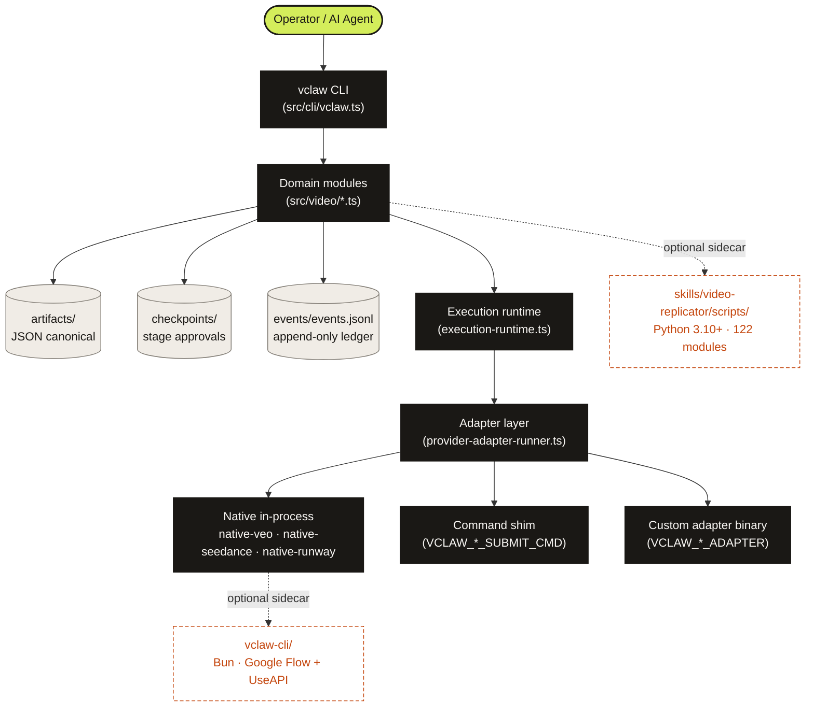
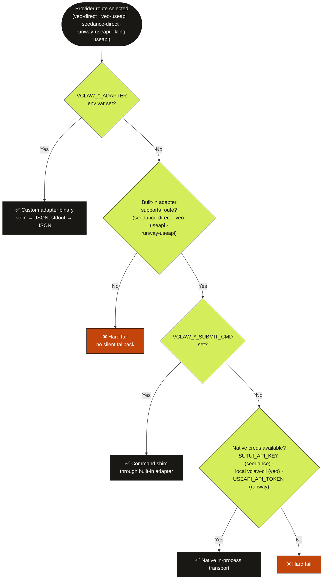
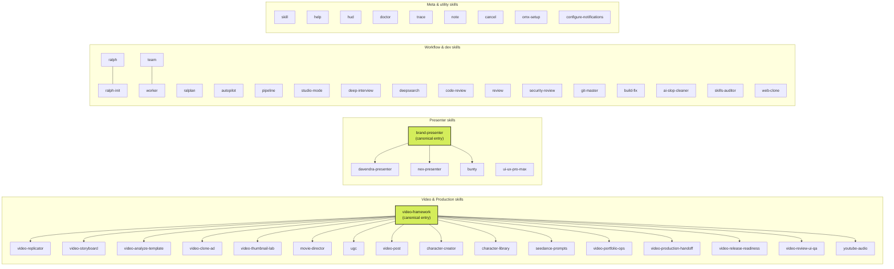

# Diagrams Source

This file is the **canonical source** for the diagrams used in `README.md`,
`docs/ARCHITECTURE.md`, and other top-level docs. The Mermaid blocks below
are the human-readable, version-controlled source of truth. The
corresponding JPGs in `docs/assets/diagram-*.jpg` are rendered from these
sources (via Go Bananas Pro `workflow-diagrams` skill, or any Mermaid
renderer).

If a diagram looks out of date in the rendered JPG, update the Mermaid
here first, then regenerate the JPG.

---

## 1. Architecture (`docs/assets/diagram-architecture.jpg`)

Shows the request flow from operator/agent through the CLI into the
domain layer, the artifact/event ledger, the execution runtime, and the
adapter tier. Plus the two opt-in sidecars (`vclaw-cli/` Bun package and
`skills/video-replicator/scripts/` Python pipeline) that the main
TypeScript repo invokes via subprocess when needed.

---

## 2. Provider routing (`docs/assets/diagram-routing.jpg`)

Decision tree the dispatcher walks for each route. Hard-fails by design
if no path resolves — no silent fallback across materially different
provider paths.

---

## 3. Skills ecosystem (`docs/assets/diagram-skills-ecosystem.jpg`)

52 skills as of 2026-05-25, grouped by purpose. The current canonical
source is `skills/catalog.json` — this diagram is illustrative.

> **Note on the rendered JPG:** the current `diagram-skills-ecosystem.jpg`
> header says "51 total" — off by one from the Mermaid source above.
> A v3 regeneration was attempted and produced WORSE artifacts
> (hallucinated headers and misplaced cards), so the v2 render was
> kept. The footnote in the JPG already directs readers to
> `skills/catalog.json` as the authoritative count, so the minor header
> drift is acceptable until the next clean regeneration.

Two canonical entry points (highlighted): **`video-framework`** for
generic video requests (delegates to specialist children), and
**`brand-presenter`** for branded host/presenter videos (specialized
by bunty / davendra / nex profiles).

