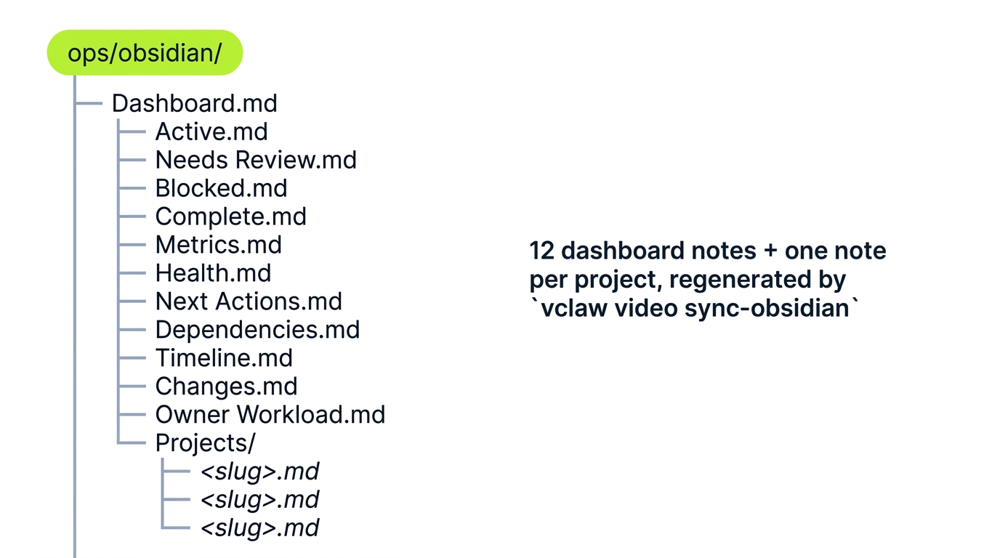

# Obsidian operator workspace

`videoclaw` ships first-class **Obsidian** support so the operator can run the production
portfolio from a knowledge-base UI rather than from terminal output. The repo writes a vault of
machine-generated notes that mirror the canonical project state — dashboards, queues, metrics, health,
timelines, dependencies, and per-project notes — all regenerated from a single command.

> **Obsidian is a view, not the source of truth.** The repo state on disk
> (`projects/<slug>/`, `artifacts/`, `checkpoints/`, `events/`) is canonical.
> The Obsidian vault is a regenerable rendering of that state.

---

## What this gives you

- **A control plane that isn't a terminal.** Browse the active queue, blockers, owners, dependencies,
  and review-state ladder from a normal Obsidian sidebar.
- **Linkable, navigable history.** Every project gets its own note with frontmatter, artifact references,
  and bidirectional backlinks into dashboard notes.
- **Honest health visibility.** Dashboards count missing approvals, stale reviews, blocked work, and due
  risk — backed by the same `doctor-portfolio` and `metrics` machinery that drives reporting.
- **Zero lock-in.** Notes are plain markdown files that live wherever you point `--output-dir`. You can
  delete the vault any time and regenerate from canonical state with one command.

---

## Vault layout

<p align="center"></p>

```text
ops/obsidian/                 # vault root (path is your choice via --output-dir)
├── Dashboard.md              # top-of-vault summary; start here
├── Active.md                 # projects currently in flight
├── Needs Review.md           # awaiting director-mode storyboard approval
├── Blocked.md                # explicitly blocked-by something or someone
├── Complete.md               # published / shipped / archived
├── Metrics.md                # counts, rates, score averages, byReviewState
├── Health.md                 # doctor-portfolio rollup
├── Next Actions.md           # urgency-ordered action queue
├── Dependencies.md           # blocker graph
├── Timeline.md               # event timeline across the portfolio
├── Changes.md                # snapshot diff narrative
├── Owner Workload.md         # owner-by-owner project load
└── Projects/                 # one note per project
    ├── <slug>.md
    ├── <slug>.md
    └── <slug>.md
```

Everything below the vault root is regenerated from canonical state on each `sync-obsidian` run, so the
vault is safe to delete and rebuild.

---

## Setup

### One-time scaffold

```bash
vclaw video scaffold-obsidian-vault --output-dir ./ops/obsidian
```

This creates the vault root with empty dashboard files and the `Projects/` folder. You can open the
folder as an Obsidian vault immediately.

### Single-project export

```bash
vclaw video export-obsidian \
  --project my-project \
  --output-dir ./ops/obsidian/Projects
```

Writes one project note for `my-project` and nothing else. Useful for incremental updates between
full syncs.

### Full sync (the common case)

```bash
vclaw video sync-obsidian --root . --output-dir ./ops/obsidian
```

Regenerates **every** dashboard note plus a project note for every project under `--root`. Idempotent —
running it twice produces the same vault. This is what you call after a meaningful CLI change.

The `--mode` flag (`storyboard` or `director`) filters the vault to one production mode if you maintain
separate vaults per mode.

---

## The 12 dashboard notes

| Note | What it shows | When to check |
|---|---|---|
| **Dashboard.md** | Portfolio summary: total projects, current state breakdown, top metrics, links to other notes. | First thing every morning. |
| **Active.md** | Every project currently in flight (pre-publish, not blocked). | Whenever you want a "what's actually moving" view. |
| **Needs Review.md** | Projects in `awaiting-approval` (director-mode storyboard awaiting your sign-off). Includes link to each `storyboard.md` review file and review freshness. | Before approving any director-mode execution. |
| **Blocked.md** | Projects with explicit `blockedBy` or `blockedReason` set on the manifest. | When triaging — what's stuck and why. |
| **Complete.md** | Published, shipped, or archived projects. | Retrospectives; reuse-as-template candidates. |
| **Metrics.md** | Counts, rates, score averages, `byReviewState` breakdown (`missing` / `current` / `stale`). | Weekly portfolio review. |
| **Health.md** | `doctor-portfolio` rollup: missing artifacts, stale reviews while approval is pending, broken stage states, count of projects in each failure mode. | Whenever Metrics looks off, or before a release. |
| **Next Actions.md** | Urgency-ordered action queue. For director-mode awaiting-approval projects, links directly to the active `storyboard.md` review and shows review freshness. | Daily triage — what to do next. |
| **Dependencies.md** | Blocker graph across the portfolio (who is blocked by whom). | When unblocking work or planning a freeze. |
| **Timeline.md** | Event timeline across the portfolio, drawn from `events/events.jsonl` per project. | Investigating "what happened when?". |
| **Changes.md** | Snapshot diff narrative: what's new since the last `report-snapshot`. Surfaces review-state transitions (`missing → current`, `current → stale`). | Before standups; before publishing reports. |
| **Owner Workload.md** | Owner-by-owner project load with priorities and due risk. | Resourcing conversations. |

---

## Project notes

Each project under `--root` gets its own note at `Projects/<slug>.md`. Project notes carry **frontmatter**
that Obsidian treats as queryable properties.

### Frontmatter schema

| Field | Source | Purpose |
|---|---|---|
| `slug` | `project.json` | Stable project identifier |
| `state` | derived from checkpoints | Lifecycle state (`active`, `awaiting-approval`/`needs-review`, `blocked`, `complete`, ...) |
| `mode` | `project.json` | Production mode (`storyboard` / `director`) |
| `score` | scorecard | Composite quality/health score |
| `scoreBand` | scorecard | Score bucket (e.g. `green` / `amber` / `red`) |
| `owner` | `set-meta` | Responsible operator |
| `priority` | `set-meta` | `low` / `medium` / `high` / `critical` |
| `dueDate` | `set-meta` | ISO date the project is due |
| `dueRisk` | derived | `none` / `at-risk` / `overdue` |
| `tags` | `set-meta` | Free-form tags for grouping |
| `blockedBy` | `set-meta` | Slugs of blocking projects |
| `blockedReason` | `set-meta` | Free-form blocker description |
| `storyboardReviewState` | derived | `missing` / `current` / `stale` (the review-state ladder) |
| `storyboardReviewPath` | derived | Filesystem path to the active `storyboard.md` |
| `storyboardReviewGeneratedAt` | derived | When the review was last regenerated |
| `characterProfiles` | character store | Count of project character profiles |
| `characterHydrationSummary` | derived | Counts of explicit / imported / auto-created characters |
| `executionProfile` | manifest | Aspect-ratio, quality, resolution, audio, outputs |
| `targetRuntime` | brief | Final video length target |
| `clipDuration` | brief | Per-clip duration |
| `genre` | brief (director-mode) | Selected genre |
| `artifactRefs` | filesystem | Links into the canonical artifact JSON |

These fields are queryable in Obsidian via the [Dataview](https://blacksmithgu.github.io/obsidian-dataview/)
plugin if you want to roll your own ad-hoc views.

### Note body

Below the frontmatter, each project note contains:

- **Stage status** — current checkpoint and next action
- **Character bindings** — referenced scene characters with stored Go Bananas IDs and reference assets
- **Storyboard review** — link to `storyboard.md` plus review-state and freshness
- **Recent events** — tail of `events/events.jsonl`
- **Artifact links** — direct paths into the canonical JSON contracts
- **Cost estimate** — if computed, the approval-gate cost and wall-time estimate

---

## The daily operator loop

<p align="center"></p>

A typical day for an operator running a multi-project portfolio:

1. **Make changes** — use the CLI to advance work: `brief`, `storyboard`, `produce`, `review`, `publish`,
   `set-meta`, `approve`, etc.
2. **Sync the vault** — `vclaw video sync-obsidian` regenerates every dashboard note plus all project
   notes from canonical state.
3. **Read the Dashboard** — open `Dashboard.md`, then drill into `Active.md`, `Health.md`, and
   `Needs Review.md` for the high-signal views.
4. **Triage the queue** — open `Next Actions.md` to see the urgency-ordered action queue. Director-mode
   approvals link straight to the active `storyboard.md`.
5. **Update metadata** — change owners, priorities, due dates, blockers, or approval state via the CLI
   (`set-meta`, `approve`). Repeat from step 2.

The loop is intentionally one-directional: you never edit notes by hand and expect them to flow back to
canonical state. The CLI is the only writer.

---

## Common workflows

### "What needs my approval today?"

1. `vclaw video sync-obsidian`
2. Open `Needs Review.md`
3. Click into each project; expand the linked `storyboard.md`
4. Run `vclaw video approve --project <slug>` for the ones you sign off on
5. Re-sync

### "What's blocked and on whom?"

1. Open `Blocked.md` for the explicit blockers
2. Cross-reference with `Dependencies.md` for the blocker graph
3. Use `set-meta --blocked-by <slug> --blocked-reason "<text>"` to update state from the CLI

### "Who is overloaded?"

1. Open `Owner Workload.md` for the owner-by-owner picture
2. Sort by priority/due risk
3. Reassign via `set-meta --owner <name>`

### "What changed since yesterday?"

1. Run `vclaw video report-snapshot` once a day to persist a baseline
2. Open `Changes.md` for the diff narrative — this surfaces review-state transitions and snapshot deltas
3. Use `report-diff --from <snapshot-path> --to <snapshot-path>` for explicit point-to-point comparison

### "Is the portfolio healthy?"

1. Open `Health.md` for the doctor-portfolio rollup
2. Cross-reference `Metrics.md` for `byReviewState` and approval-queue depth
3. Use `vclaw video doctor-project --project <slug>` to dive into a specific project

---

## Maintenance loop

Recommended local rhythm:

```bash
vclaw video metrics                          # quick sanity check
vclaw video next-actions                     # what's urgent
vclaw video doctor-portfolio                 # health rollup
vclaw video report-snapshot                  # persist baseline for diffs
vclaw video sync-obsidian                    # regenerate the vault
```

Run after meaningful CLI changes. The packaged pre-flight is the safer alternative if you want to
catch regressions before syncing:

```bash
npm run check:release-readiness-lite
```

---

## Tips

- **Treat the vault as a build artifact.** Don't hand-edit notes. Rebuild instead.
- **Pin `Dashboard.md`** as the Obsidian default note so it's the first thing you see.
- **One vault per mode** if you run both `storyboard` and `director` at scale — pass `--mode` to filter.
- **Combine with [Dataview](https://blacksmithgu.github.io/obsidian-dataview/)** for custom queries on
  the project frontmatter (e.g. *"show all director-mode projects with stale reviews owned by X"*).
- **Version the vault** in a separate git repo if you need historical state — but remember canonical
  history already lives in `events/events.jsonl` and `artifacts/history/`.

---

## Source of truth

The repo state on disk is **always canonical**. The Obsidian vault is a regenerable view.

If a vault note disagrees with the CLI, the CLI is right — re-sync. If the CLI disagrees with what
actually shipped, the artifact JSON in `projects/<slug>/artifacts/` is right — let `doctor` find the
drift.

```text
canonical state on disk
        │
        ▼
    sync-obsidian       ← regenerates everything
        │
        ▼
  Obsidian vault        ← view layer; safe to delete
```

---

## See also

- [`README.md`](../README.md) — repo front door
- [`docs/SKILLS.md`](./SKILLS.md) — comprehensive skills reference
- [`docs/OPERATIONS.md`](./OPERATIONS.md) — day-to-day maintenance loop
- [`docs/CLI_REFERENCE.md`](./CLI_REFERENCE.md) — full CLI surface
